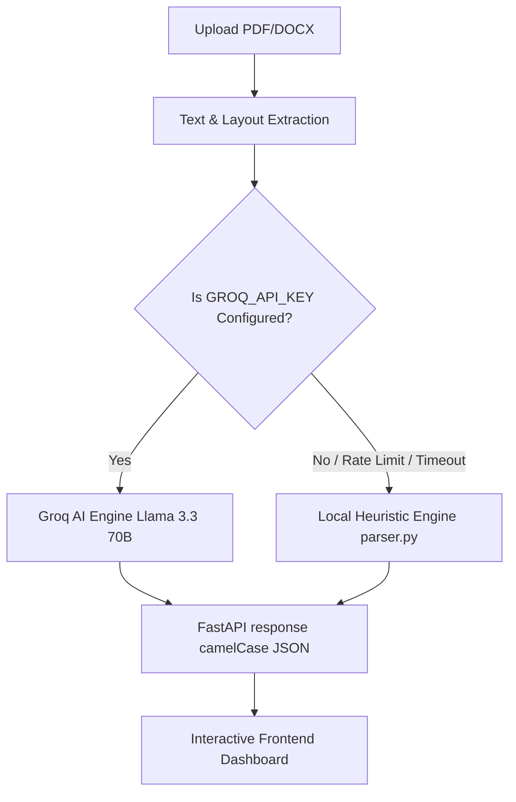

# 🚀 ResuRank AI — Resume Screener & Career Copilot

ResuRank AI is a high-performance, hybrid-engine application designed to evaluate resumes, perform job role alignment gap analyses, and chart potential career trajectories. It leverages a dual-engine architecture featuring **LLM reasoning (Groq/Llama 3.3 70B)** and a robust **local heuristic fallback system** to deliver instant, actionable feedback.

---

## 🌟 Key Features

### 1. ATS Compatibility Dashboard
* **Instant Grading**: Evaluates resume text and formatting parameters to compute a composite score (0-100).
* **Dimensional Breakdown**: Scores categorized across key ATS vectors:
  * **Keywords**: Detects presence of industry-standard tech stack and domain terminology.
  * **Formatting**: Analyzes section hierarchies, page count (under- or over-length), and structural issues.
  * **Impact**: Evaluates action verbs, metrics, and quantitative achievements.
* **Detailed Feedback**: Provides a list of core strengths and itemized, actionable improvements.

### 2. Job Role Matcher
* **Position Alignment**: Compares the parsed resume text against any user-specified target role (e.g., *Frontend Engineer*, *Machine Learning Specialist*).
* **Gap Analysis**:
  * **Matched Skills**: Highlights skills matching the target role.
  * **Missing Skills**: pinpoints technologies or methodologies to acquire.
  * **Recommended Certifications & Projects**: Provides suggestions to bolster candidate profiles.
* **Resume Guidelines**: Offers structure and content adjustments tailored to the target job description.

### 3. AI Career Explorer
* **Career Archetype Mapping**: Classifies the candidate into unique archetypes (e.g., *Builder*, *Specialist*, *Catalyst*, *Leader*) based on profile strength.
* **Career Trajectories**:
  * **Perfect Fit Roles**: Current career paths matching existing skills.
  * **Pivotable Roles**: Adjacent tracks with a step-by-step roadmap to successfully transition.
  * **Not-a-Fit Roles**: High-friction directions, accompanied by clear explanations of why.

---

## 🛠️ Technology Stack

### Backend
* **FastAPI**: Asynchronous Python web framework for highly performant APIs.
* **PyPDF & python-docx**: Direct text and layout extraction from PDF and Word documents.
* **Pydantic**: Strict data parsing, validation, and JSON serialization.
* **Uvicorn**: Lightning-fast ASGI web server implementation.

### Frontend
* **Vite + React (TypeScript)**: Ultra-fast build tool and type-safe component architecture.
* **TanStack Router**: Fully type-safe routing client.
* **Tailwind CSS & Shadcn UI**: Sleek, modern dashboard design with micro-animations and dark mode support.
* **Lucide React**: Vector icons and visual cues.

### AI Engine
* **Groq Cloud API**: Utilizes the state-of-the-art open-source `llama-3.3-70b-versatile` model for deep contextual analysis, reasoning, and semantic understanding.

---

## 📐 Resilient Hybrid Architecture

ResuRank AI is built for reliability. It implements a **Dual-Engine Pipeline**:



1. **Primary AI Engine**: Sends parsed text and layout metadata to Groq. It uses highly engineered system prompts to yield structured JSON containing ATS metrics, career archetypes, and role match data.
2. **Local Fallback Engine**: If the Groq API key is missing, rate-limited, or fails due to network issues, the application transparently transitions to the local rule-based system (`parser.py`). This engine uses regex matchers, dictionary catalogs, and layout scoring metrics to return matching schemas without degrading the user experience.

---

## 📁 Repository Structure

```
├── backend/
│   ├── main.py             # FastAPI app, endpoints, and middleware
│   ├── ai_engine.py        # Groq Llama 3.3 LLM prompts and calls
│   ├── parser.py           # Text extraction and local fallback rule-based parser
│   ├── schemas.py          # Pydantic data models matching frontend expectations
│   ├── requirements.txt    # Python backend dependencies
│   ├── test_backend.py     # Endpoint unit tests
│   └── .env                # Local secrets (API keys) - [Ignored]
│
├── frontend/
│   ├── src/
│   │   ├── components/
│   │   │   └── resurank/   # Main ResuRankApp.tsx frontend dashboard
│   │   ├── routes/         # TanStack routes
│   │   ├── styles.css      # Core styling and Tailwind layout definitions
│   │   └── router.tsx      # Routing configuration
│   ├── package.json        # Node modules configuration
│   └── vite.config.ts      # Vite bundling configurations
│
└── README.md               # You are here
```

---

## 🚀 Getting Started

### Prerequisites
* Python 3.9 or higher
* Node.js v18+ (or Bun package manager)

---

### Step 1: Set Up the Backend

1. Navigate to the `backend` directory:
   ```bash
   cd backend
   ```

2. Create a virtual environment:
   ```bash
   python -m venv venv
   ```

3. Activate the virtual environment:
   * **Windows (PowerShell):**
     ```powershell
     .\venv\Scripts\Activate.ps1
     ```
   * **macOS / Linux:**
     ```bash
     source venv/bin/activate
     ```

4. Install the backend dependencies:
   ```bash
   pip install -r requirements.txt
   ```

5. Create a `.env` file in the `backend/` directory:
   ```env
   GROQ_API_KEY=gsk_your_groq_api_key_here
   ```
   > 💡 *Note: If no API key is specified, the application will fallback automatically to the rule-based engine.*

6. Start the FastAPI development server:
   ```bash
   uvicorn main:app --reload --port 8000
   ```
   The API will be available at `http://localhost:8000`. You can inspect the interactive docs at `http://localhost:8000/docs`.

---

### Step 2: Set Up the Frontend

1. Navigate to the `frontend` directory:
   ```bash
   cd ../frontend
   ```

2. Install dependencies:
   * **Using Bun (Recommended):**
     ```bash
     bun install
     ```
   * **Using npm:**
     ```bash
     npm install
     ```

3. Start the Vite development server:
   * **Using Bun:**
     ```bash
     bun run dev
     ```
   * **Using npm:**
     ```bash
     npm run dev
     ```
   The web UI will be accessible at `http://localhost:5173`.

---

## 🧪 Verification & Testing

To run the backend test suite, make sure you are in the `backend` directory with your virtual environment active, and execute:

```bash
pytest test_backend.py
```

This verifies that the file parser, fallback scorers, and API routing structures function as expected under various upload payloads.
